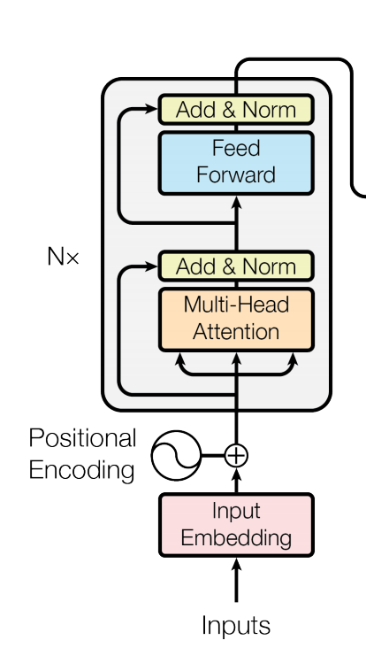
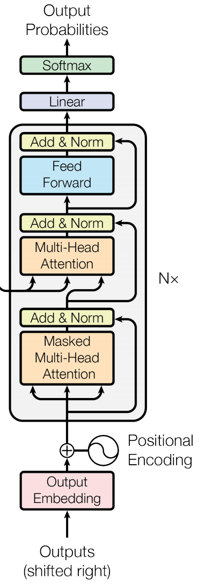
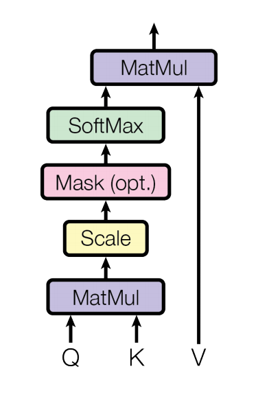
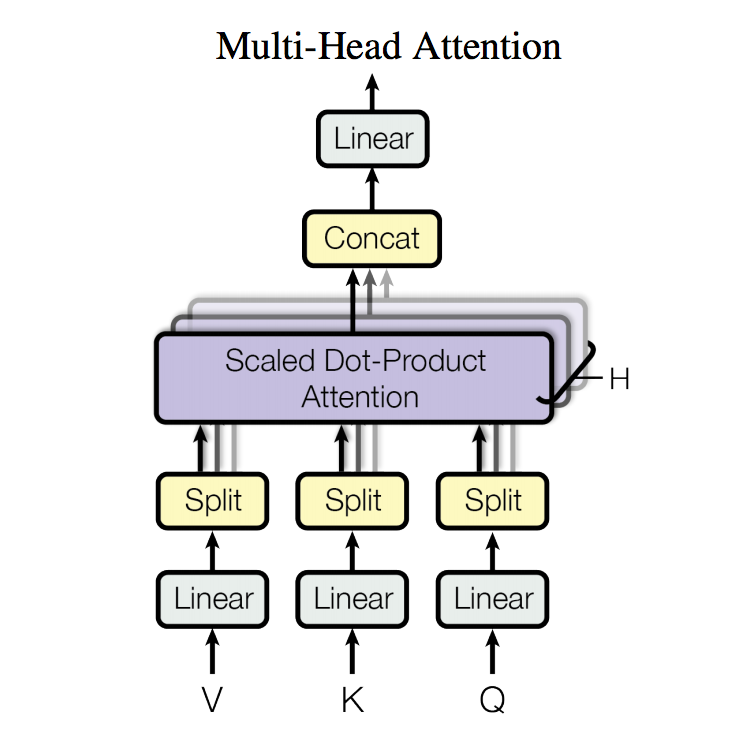

## All You Need Is Attention

**Authors**: *Ashish Vaswani, Noam Shazeer, Niki Parmar, Jakob Uszkoreit, Llion Jones, Aidan N. Gomez, Lukasz Kaiser, Illia Polosukhin*

**Gist**: The authors propose a network architecture dubbed **Transformer** that does not require convolutions or recurrence and that proves effective for sequence modeling tasks like *machine translation* and *language modeling*.

**Significance**: Allows for parallelization which in turn leads to significantly shorter training time.

## Architecture

#### Encoder

<p align="center">
 
</p>

The encoder is composed of `N = 6` identical layers, each composed of 2 sub-blocks.

- **Block 1**: multi-head self attention mechanism
- **Block 2**: fully-connected feed-forward network

Each block uses a residual connection followed by a normalization layer at its output. The feedforward network consists in 2 linear transformations with a ReLU activation in between.

In conclusion, the encoder architecture is as follows:

```python
out_1_block_1 = multihead_attention(x) + x
out_2_block_1 = layer_normalization(out_1_block_1)

out_1_block_2 = feed_forward_net(out_2_block_1) + out_2_block_1
out_2_block_2 = layer_normalization(out_1_block_2)

out_enc = out_2_block_2
```
Note that the input to the encoder also consists of 2 elements:

- **embedded inputs**: the input and output tokens are embedded into a vector of `size = 512`.
- **positional encoding**: positional encoding is used to add information about the position of the I/O tokens relative to the sequence. In this case, sinusoidal positional encoding is used of same dimension (`512`) as the embedded inputs.

Concretely, positional encoding is computed as follows:

```python
def pos_encoding(pos, i, even=True):
	exp = 2*i / 512
	denum = np.power(10000, exp)
	
	if even:
		return np.sin(pos / denum)
	else:
		return np.cos(pos / denum)
```

Once computed, the embedded inputs and the positional encoding are added and fed to the encoder.

#### Decoder

<p align="center">
 
</p>

The decoder is also composed of `N = 6` identical layers, but each is composed of 3 sub-blocks.

- **Block 1**: masked multi-head self attention mechanism
- **Block 2**: multi-head self attention mechanism
- **Block 3**: fully-connected feed-forward network

The masked multi-head self attention mechanism (i.e. Block 1) is causal or "*masked*" meaning it cannot look into the future, but only at the past when predicting the i'th position of the sequence. This block acts on the output embedding.

Note that the remaining Block 2 and Block 3 are identical to those used in the encoder.

In conclusion, the decoder architecture is as follows:

```python
out_1_block_1 = masked_multihead_attention(x) + x
out_2_block_1 = layer_normalization(out_1_block_1)

out_1_block_2 = multihead_attention(out_2_block_1 + out_enc) + out_2_block_1
out_2_block_2 = layer_normalization(out_1_block_2)

out_1_block_3 = feed_forward_net(out_2_block_2) + out_2_block_2
out_2_block_3 = layer_normalization(out_1_block_3)

out_dec = out_2_block_3
```

## Attention Mechanism

<p align="center">
 
</p>

At its bare bones, the attention mechanism takes 2 inputs (query, key-value pairs) and outputs a weighted sum of the values whose weights are proportional to how much each value interacts or is "*compatible*" with the query.

This gives us a score for each key-value pair to which we apply a softmax to obtain a sort of probability.

```python
def attention(Q, K, V):
	num = np.dot(Q, K.T)
	denum = np.sqrt(K.shape[0])
	return np.dot(softmax(num / denum), V)
```

Then instead of performing a single attention function, the authors parallelize it to 8 attention layers each attending to 64 key-value pairs and queries. 

<p align="center">
 
</p>

## Other Details

#### Regularization

Dropout is used both at the output of each sub-layer and in the attention blocks. Probability of dropout `p = 0.1`.

#### Optimizer

Adam is used with `(beta1, beta2) = (0.9, 0.98)` and `eps=1e-9`. The learning rate is increased linearly for the first warmup steps and then decreased proportionally to the inverse of the square root of the step number.